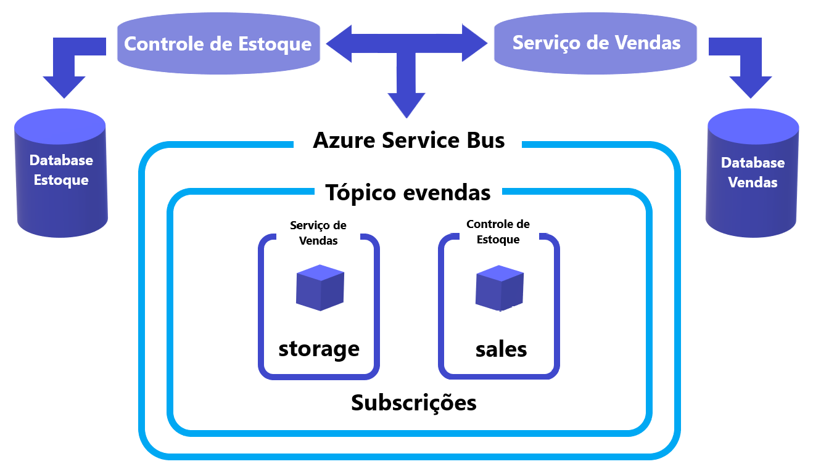

## eVendas API


### Introdução

Este projeto foi desenvolvido como parte do programa Aceleração Global Dev da Digital Innovation One e Avanade.

Com o objetivo de aplicar as melhores praticas de desenvolvimento de software com conceitos de:


   SOLID;

   Design Patterns;

   Arquitetura de Eventos;

   Aplicações utilizando Azure Service Bus.


### Sobre o Projeto


Esta solução apresenta duas aplicações web independentes, que simulam parcialmente aplicações REST conectadas via Azure Service Bus.

As aplicações são responsáveis pelo gerenciamento de estoque e vendas de um e-commerce.


* **Controle de Estoque**


   Realiza o cadastro, edição e exclusão de produtos da base de dados.

   Possui os métodos: 


       GET, POST, PUT, DELETE.


* **Controle de Vendas**


   Realiza apenas a venda de produtos.

   Possui os métodos:


       GET, PUT.


### Iniciando a aplicação


As principais dependências do projeto são:


   Entity Framework;

   Azure Service Bus;

   Data SQLite.


**Banco de Dados**


O SQLite foi escolhido como banco de dados da aplicação por ser suficientemente flexível e leve.

Alterações no banco podem ser feitas nos respectivos Repository Context de cada aplicação, alterando o atributo *dbContextOptionsBuilder*


```CSharp

namespace ControleEstoque.Repository

{

   public class RepositoryContext : DbContext

   {

       public DbSet<Product> Produtos { get; set; }

       protected override void OnConfiguring(DbContextOptionsBuilder dbContextOptionsBuilder)

       {

           dbContextOptionsBuilder.UseSqlite("Data Source=DBStorage.db");

       }

   }

}

```


As aplicações ja contem um `Migration` inicial, para criar o arquivo do banco de dados execute para a respectiva aplicação:


   Terminal no diretório raiz da aplicação /> dotnet ef database update


   Terminal do gerenciador de pacotes /> Update-DataBase


**Azure Service Bus**


Foi adotado um único tópico para as duas aplicações e foram criadas 3 subscrições as quais foram atribuídas filtros

de correlação para propriedades personalizadas nos metadados da mensagem. 


  ***controleEstroque**: storage (itens novos), update (itens que foram atualizados)* 

  ***controleVendas**: sales (itens que foram vendidos)* 





**AppSettings e Endpoints**


A *connection string*, *nome do tópico* e *subscrição* podem ser carregados diretamente no arquivo appsettings.json


```JSON

   "ServiceBus": {

       "ConnectionString": "Endpoint=sb://...",

       "EntityPath": "Nome do Tópico",

       "Subscription": "Nome da Subscrição"

   }

```


O Swagger foi implementado na aplicação sendo acessível a partir da URL `https://localhost:54676/index.html`


As aplicações podem ser acessadas a partir da URL `https://localhost:{porta}/api/product`


#### Referencias


[Documentação Azure](https://docs.microsoft.com/pt-br/azure/service-bus-messaging/)


#### Agradecimento 

Agradecimentos a Digital Innovation One e ao grupo de profissionais Seniores e Arquitetos da Avanade pela ciclo de palestras.